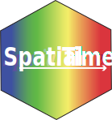

# SpatialTime
#### Spatial transcriptomics distance gradient analysis

<!-- badges: start -->


<!-- badges: stop -->


 

### Introduction
Spatial transcriptomics (ST) represents a powerful approach for assessing the gene expression landscape across tissues at single cell resolution. However, limitations regarding low sampling, histology differences among samples and lack of comprehensive visualization approaches hinders ST broader applications and analysis. SpatialTime, an R programming package, was developed aiming to tackle these challenges by calculating a distance-based gradient between spatial spots using Euclidean distances. 

### Installation 

Installation via Github:
```sh
devtools::install_github("towerlab/SpatialTime")
```
### Bugs/Issues Reports
Please, if encountering any issues or bugs submit a [Github Issue](https://github.com/towerlab/SpatialTime/issues).


### Vignette 
A complete vignette on how to use SpatialTime package is available [here](https://towerlab.github.io/SpatialTime/).

### Citation
Sokolowskei, D., Trostle, A. J., Shah, A., & Tower, R. (2025). SpatialTime Package (1.0). Zenodo. https://doi.org/10.5281/zenodo.14983368
