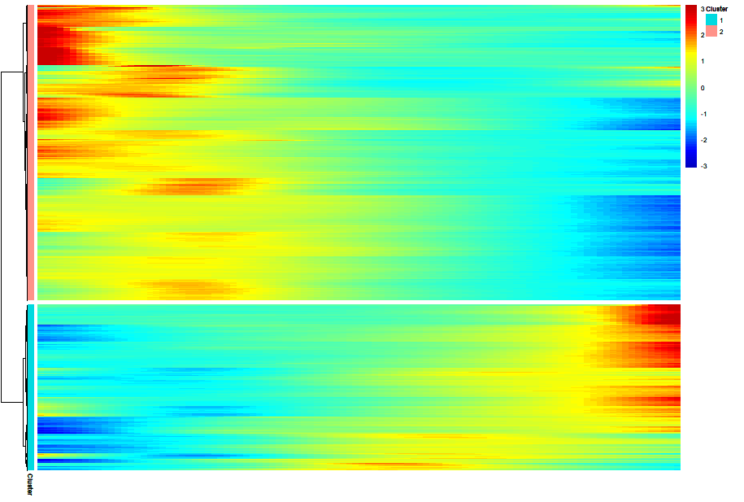
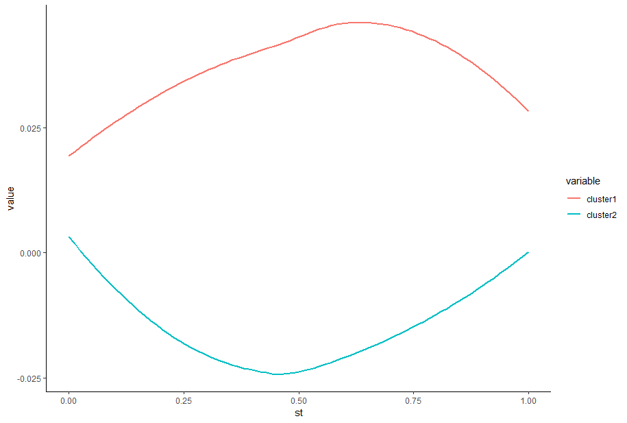
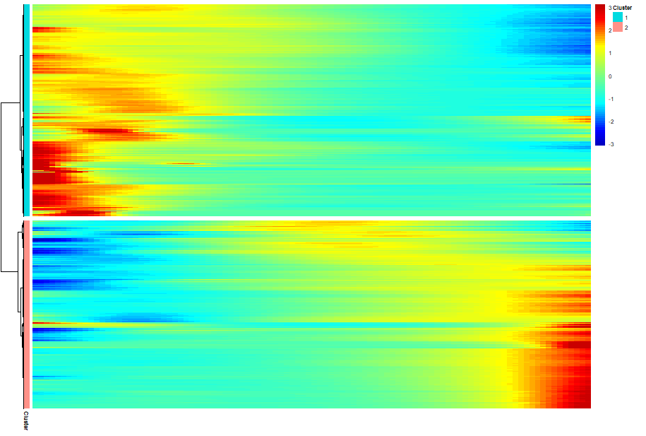
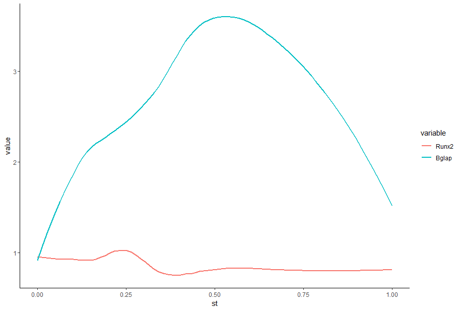
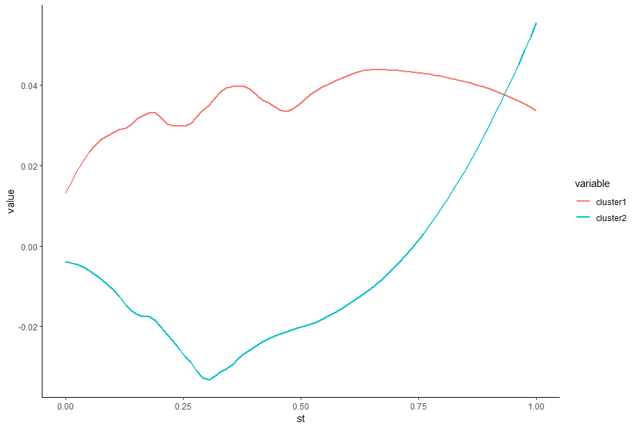

# SpatialTime 
Spatial transcriptomics (ST) enables single cell resolution gene expression analysis assessment across histologies while preserving the tissue native morphological configuration. In this context, SpatialTime package empower users to assess differential gene expression in a distance gradient, gene expression and module score pathways  across pseudotime by establishing spatially defined reference points and calculating ST spots distances against those reference spots using euclidean distances. Thus, a distance gradient can be established allowing the evaluation of gene expression profiling based on proximity of any reference line.     

## Installation
Package install via CRAN:
```sh
install.packages("SpatialTime")
```
Development version install:
```sh
#(install.packages("devtools")
devtools::install_github("dimitrisokolowskei/SpatialTime")
```
## Prerequisites
SpatialTime requires a spatial dataset already processed and integrated. Thus, any doubts on how to proceed with ST basic analysis, please visit [Seurat](https://satijalab.org/seurat/articles/spatial_vignette) vignette.

## Dataset 
For this vignette, we provide a ST example dataset obtained from [Rios et al., 2024](https://insight.jci.org/articles/view/176802#BIBL) and additional file required to run the analysis. The Seurat object can be downloaded [here](put_link).

## Analysis Approaches
SpatialTime supports different strategies for delimiting spatial reference lines by: 1) Manually defining references spots using a build-in Shiny App; 2) Selecting single cell types based on clusters identities; 3) Manually defining references lines using imaging *softwares* such as Fiji/ImageJ;   

## 1. Individual Spots Selection
1.1 First, import processed Seurat object together with libraries required.
```sh
# Libraries
library(Seurat)
library(tidyverse)
library(SpatialTime)
library(shiny)
library(plotly)
library(monocle)
library(reshape2)

# set.seed for reproducibilty 
set.seed(12345)

# Import object
nf1 <- readRDS("NF1_fracture.rds")
View(nf1@meta.data)

# Basic Spatial visualization ----
SpatialDimPlot(nf1, images = "slice1")
```
1.2 Export cluster's XY coordinates of interest. Make sure that cell types labels are in Seurat object ```Idents()```. In case they're not, clusters labels from ```seurat@meta.data``` can be added into ```Idents()```. For instance:
```sh
Idents(nf1) # Check cluster names in Seurat object identity
Idents(nf1) <- nf1$cluster_labels # Add cluster label from metadata if not into objects identity

# Export cell type coordinates to an output directory
subset2Labels(nf1, cluster = c("Cartilage","HypCH","Woven"), export.all = F, dir.out = "coord_out")
```
1.3 Once the desired clusters coordinates to be compared against to have been exported, we'll have to select our reference spots to establish the reference point for gradient distance calculation. The package's build-in Shiny app allows the manual selection of spots in a particular sample slice as reference. To navigate trough the app, use ```shift+left click``` to move around the sample and ```ctrl+left click``` to (un)select the spots. In the top right corner there's ```+``` and ```-``` signs, allowing users to zoom in or zoom out. After spots selection, click ```Export Selected Spots``` and close the Shiny app. 
```sh
# Selecting reference spots 
app <- ShinySelection(nf1, id = "Tissue")
app
```
By importing the cluster coordinate and reference spots previously selected, SpatialTime distance gradient can be calculated. For ```CoordMerge``` provide the path for coordinate folder and cluster name in ```pattern = cell_type_name```. For example, using the cluster labeled as ```Woven```, it follows:
```sh
# Import coordinates of cluster and reference spots 
frac <- CoordMerge("coord_out/", pattern = "Woven")
ref <- ShinySpots(nf1, coord_file = "selected_spots.csv")
# Calculate SpatialTime between cluster and reference ----
sp <- SpatialShinyTime(frac, ref)
sp
```
The visualization of gradient distance axis is a critical step since ensures that the desired distance axis between the clusters of interest is correct for the following steps. Moreover, by subsetting out cells, using ```subset``` function that were not included in the gradient distance calculation is recommended, since it allows a cleaner gradient visualization and faster processing in later steps.  
```sh
# Visualize spots gradient 
vis <- SpatialVis(nf1, sp, spatial.by = "rel", slice = "slice1", return_obj = F)
vis
```
```sh
vis <- SpatialVis(nf1, sp, spatial.by = "rel", slice = "slice1", return_obj = T)
View(vis@meta.data)

# Subset out spots which spatialtime (st) value were not calculated
vis <- subset(vis, subset = st != 0)
```


In order to investigate changes in gene expression across the axis distance gradient, we'll calculate and replace pseudotime values for each individual spots with their corresponding spatialtime (st) value using a ```monocle``` package wrapper function ```Pseudo2Time```. Notice that, in this case, ```return_obj``` is set to ```FALSE``` returning monocle's as ```SingleCellExperiment``` format. That way, gene expression across distance gradient can be visualized using a heatmap as follows:
```sh
# Calculate pseudotime and visualize genes differentialy expressed across distance gradient
ps <- Pseudo2Time(vis, assay = "SCT", cores = 8, return_obj = F)
p <- plot_pseudotime_heatmap(ps, num_clusters = 2, cores = 2, show_rownames = F, return_heatmap = T)
p
```


Furthermore, genes in the heatmap cluster's can be exported allowing a detailed assessment of genes present and their expression across spatialtime distance gradient using ```GenesGet``` function. Notice that ```n_clusters``` parameter should be equal to ```plot_pseudotime_heatmap``` ```num_clusters``` parameter. Otherwise, genes might be exported as belonging to wrong clusters:
```sh
genes <- GeneGet(p, n_clusters = 2)
write.csv(genes, file = "/path/directory")
```
Also, we can analyzing gene expression simply across pseudotime. This time, ```return_obj``` is set to ```TRUE```, which returns Seurat object with pseudotime added into metadata. Then, genes of interest can be visualized across pseudotime. 
```sh
# Calculate pseudotime
ps <- Pseudo2Time(vis, assay = "SCT", cores = 8, return_obj = T)
# Visualize genes across pseudotime 
GeneVis(file = ps, column = c("Runx2", "Bglap"), signal = "gene")
```


Module score pathways can also be visualized across pseudotime. First, genes related to specific pathways are set and added into Seurat object metadata. Thus, pathways are retrived from metadata and plotted across pseudotime.  
```sh
# Gene list pathways 
# Gene list pathways
bmp <- c("Acvr1","Amh","Bmp2","Bmp4","Bmp5","Bmp6","Bmp7","Bmp8a","Bmpr1a","Bmpr1b",
           "Bmpr2","Gdf5","Gdf6","Gdf7","Hamp","Hamp2","Id1","Id2","Id3","Id4",
           "Inhbb","Rgma","Rgmb","Smad1","Smad4","Smad5","Smad9")

wnt <- c("Rspo3","Rspo4","Tcf7","Tcf7l1","Tcf7l2","Wnt1","Wnt10a","Wnt10b","Wnt11",
         "Wnt16","Wnt2","Wnt2b","Wnt3","Wnt3a","Wnt4","Wnt5a","Wnt6","Wnt7a","Wnt7b",
         "Wnt8a","Wnt8b","Wnt9a","Wnt9b","Wnt5b","Axin1","Axin2")

# Add gene modules in object with pseudotime calculated
gene_modules <- list(Module1 = bmp, Module2 = wnt)
module <- AddModuleScore(vis, features = gene_modules, assay = "SCT", name = "cluster")
GeneVis(file = module, column = c("cluster1", "cluster2"), signal = "pathway", span = 0.1)
```


## 2. Cluster selection based approach
The basic underlying concept of SpatialTime using the cluster selection based approach is the same as previously described. However, there's no need to manually select spatial spots as reference, since all spots within a cluster of interest we'll be used as reference, therefore potentially allowing a even faster and straighfoward analysis.

2.1 Import Seurat's object and ensure that cell clusters are annotated and present in your object ```Idents()```. 
```sh
# Libraries
library(Seurat)
library(tidyverse)
library(SpatialTime)
library(monocle)
library(reshape2)

# Import NF1 data ----
nf1 <- readRDS("NF1_fracture.rds")
View(nf1@meta.data)

Idents(fracture) # Check cluster names in Seurat object identity
Idents(fracture) <- fracture$cluster_labels # Add cluster label from metadata into objects identity

# Export cell type coordinates to an output directory
subset2Labels(nf1, cluster = c("Cartilage","HypCH","Woven"), export.all = F, dir.out = "coord_out")
```

2.2 Import clusters coordinates and run ```Spatial2Time``` for gradient distance calculation:
```sh
# Selecting directories specific coordinates ----
woven <- CoordMerge("coord_out", pattern = "Woven")
ref <- CoordMerge("coord_out", pattern = "Cartilage")

# Calculate SpatialTime between clusters of interest ----
sp <- Spatial2Time(woven, ref)
sp
```

2.3 Visualize gradient distance calculated in the previous step. If gradient distance axis follows the desired direction between clusters assign ```return_obj``` to ```TRUE``` allowing spatialtime values addition into object's metadata. For instance:
```sh
# Distance gradient visualization ----
vis <- SpatialVis(nf1, sp, spatial.by = "rel", slice = "slice1", return_obj = F)
vis
# Adding st into metadata
vis <- SpatialVis(nf1, sp, spatial.by = "rel", slice = "slice1", return_obj = T)
View(vis@meta.data)

# Subset out spots which spatialtime (st) value were not calculated
vis <- subset(vis, subset = st != 0)
```


2.4 By calculating pseudotime and assigning ```return_obj``` to ```FALSE``` genes differentialy expressed across spatial distance can be visualize using a heatmap:
```sh
# Pseudotime Calculation ----
ps <- Pseudo2Time(vis, assay = "SCT", cores = 8, return_obj = F)
p <- plot_pseudotime_heatmap(ps, num_clusters = 2, cores = 2, show_rownames = F, return_heatmap = T)
p
```


2.5 Export genes ID from heatmap clusters:
```sh
genes <- GeneGet(p, n_clusters = 2)
write.csv(genes, file = "/path/directory")
```

2.6 Once more, in order to assess individual genes expression across spatialtime distance gradient we perform: 
```sh
# Calculate pseudotime
ps <- Pseudo2Time(vis, assay = "SCT", cores = 8, return_obj = T)
GeneVis(file = ps, column = c("Runx2", "Bglap"), signal = "gene", span = 0.5)
```


2.7 Visualization of pathways using module score can done as follows:
```sh
# Gene list pathways
bmp <- c("Acvr1","Amh","Bmp2","Bmp4","Bmp5","Bmp6","Bmp7","Bmp8a","Bmpr1a","Bmpr1b",
           "Bmpr2","Gdf5","Gdf6","Gdf7","Hamp","Hamp2","Id1","Id2","Id3","Id4",
           "Inhbb","Rgma","Rgmb","Smad1","Smad4","Smad5","Smad9")

wnt <- c("Rspo3","Rspo4","Tcf7","Tcf7l1","Tcf7l2","Wnt1","Wnt10a","Wnt10b","Wnt11",
         "Wnt16","Wnt2","Wnt2b","Wnt3","Wnt3a","Wnt4","Wnt5a","Wnt6","Wnt7a","Wnt7b",
         "Wnt8a","Wnt8b","Wnt9a","Wnt9b","Wnt5b","Axin1","Axin2")

# Add gene modules in object with pseudotime calculated
gene_modules <- list(Module1 = bmp, Module2 = wnt)
module <- AddModuleScore(vis, features = gene_modules, assay = "SCT", name = "cluster")
GeneVis(file = module, column = c("cluster1", "cluster2"), signal = "pathway", span = 0.1)
```




## 3. Fiji/ImageJ based approach
3.1 Fiji is a broadly used open source scientific image processing tool. Fiji allows drawing the reference lines of interest and exporting each delineated pixel as an XY coordinates later used for euclidean distance calculation. Fiji can be downloaded [here](https://imagej.net/software/fiji/) and a brief Fiji tutorial on how draw and export references lines can be found [here](to put).

3.2 First, import your Seurat ST object using ```readRDS()``` function. Then, we proceed using ```subsetLabels()``` which allows us to export ST clusters coordinates as excel sheets.
```sh

# Required packages
library(Seurat)
library(tidyverse)
library(Hmisc)
library(jsonlite)
library(monocle)
library(fs)
library(SpatialTime)

# Import ST object
fracture <- readRDS("R/fracture_original_annotation.rds")

# Export clusters coordinates 
subsetLabels("R/fracture_original_annotation.rds", cluster = c("MarrowFibrin", "Periosteum", "Cortical"), slice.n = "slice1", export.all = T, dir.out = "R/Excel/")
```

3.3 Import Fiji XY coordinates previously prepared. Furthermore, we need to match the reference line colors to their respective tissue/region names. Be aware that the tissue names must exist in your Seurat object identities. Then, by running ```SpatialCalc()``` each XY coordinate can be transformed accordingly to the slice factor.  
```sh
fiji <- read.csv("R/fiji_output.csv")
colors <- c("Red", "Green", "Blue") 
tissue <- c("MarrowFibrin", "Periosteum", "Cortical") 

data <- SpatialCalc("R/fiji_output.csv", factor = "R/scalefactors_json.json", colors = colors, tissue = tissue) 
```

3.4 At this step, SpatialTime distance are ready to be calculated. First, import your cluster type coordinates as reference and calculate the spots distances against other cluster. 
```sh
# Calculate minimum spots distances from reference line of interest
file <- read.csv("R/Excel/Periosteum_coordinates.csv")

sp <- SpatialTime(file, "MarrowFibrin")
sp
```

3.5 
SpatialTime distance gradient can be assessed using:
```sh
# Visualization spatialtime gradient ----
vis <- SpatialVis(fracture, sp, spatial.by = "rel", remove.na = T, return_obj = T)
vis
View(vis@meta.data)
```

3.6 
```Pseudotime``` allows calculating and adding pseudotime values in the object metadata. By replacing the calculated spatialtime values into their respective pseudotime, it becomes possible to infer which genes are differential expressed as a gradient of distance. Briefly, we can assess which genes are up or downregulated as you move away from the reference line.  
```sh
# Calculate pseudotime ----
ps <- PseudoTime(vis, assay = "SCT", min_expr = 0.1, min_cells = 5, mean_expr = 0.1, cores = 8)
View(ps@meta.data)

p <- plot_pseudotime_heatmap(ps, num_clusters = 3, cores = 12, show_rownames = T, return_heatmap = T)
```

3.7 Basic Visualization 
```sh
des <- GeneVis(ps, genes = c("HBA1","COL1A1","SOX9"))
View(des@meta.data)


ggplot(des@meta.data) +
  geom_smooth(aes(st, COL1A1, color = "COL1A1"), method = "loess", span = 1, se = FALSE) +
  geom_smooth(aes(st, SOX9, color = "SOX9"), method = "loess", span = 1, se = FALSE) +
  scale_color_manual(values = c("COL1A1" = "#E69F00", "SOX9" = "#56B4E9")) +
  theme_classic()
```

