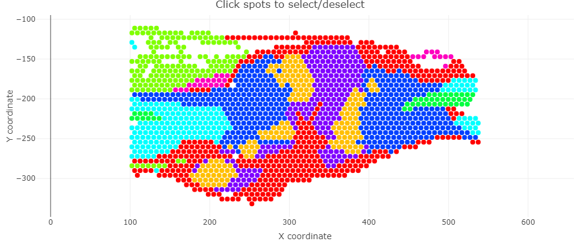
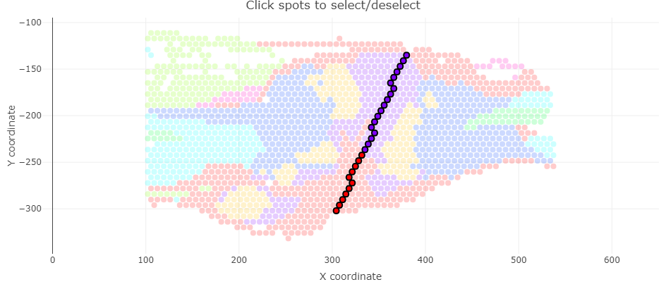
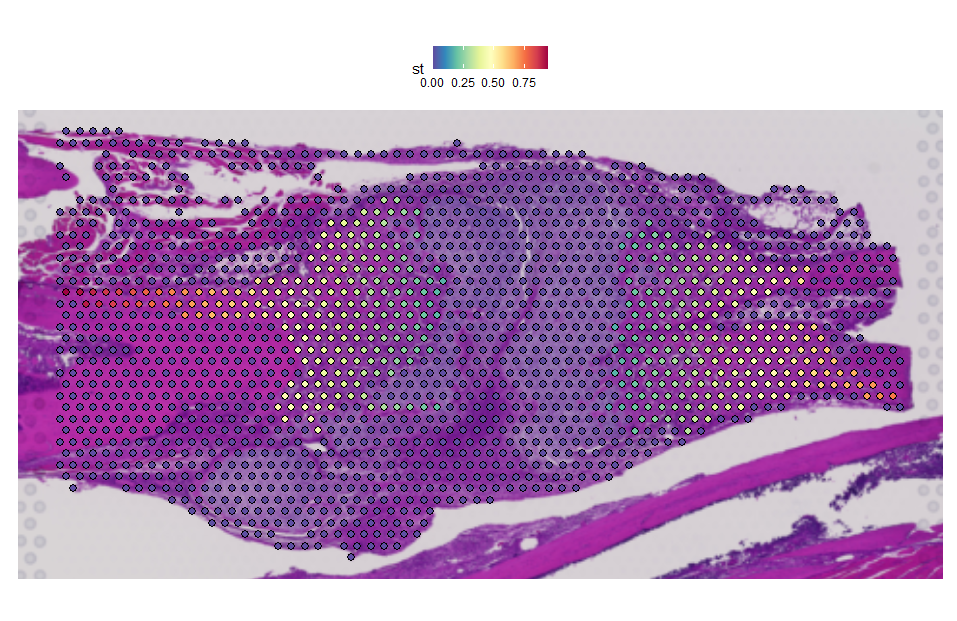
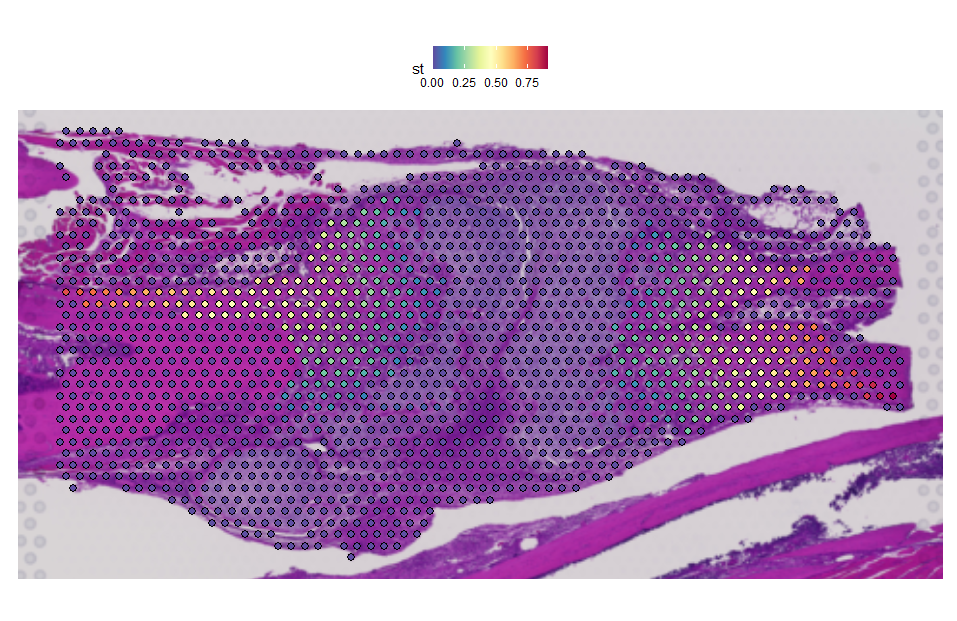
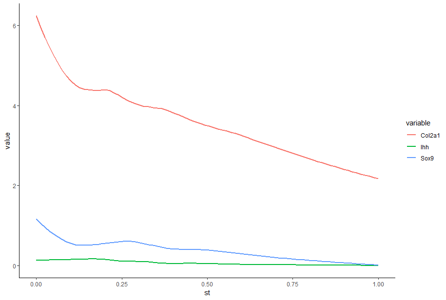
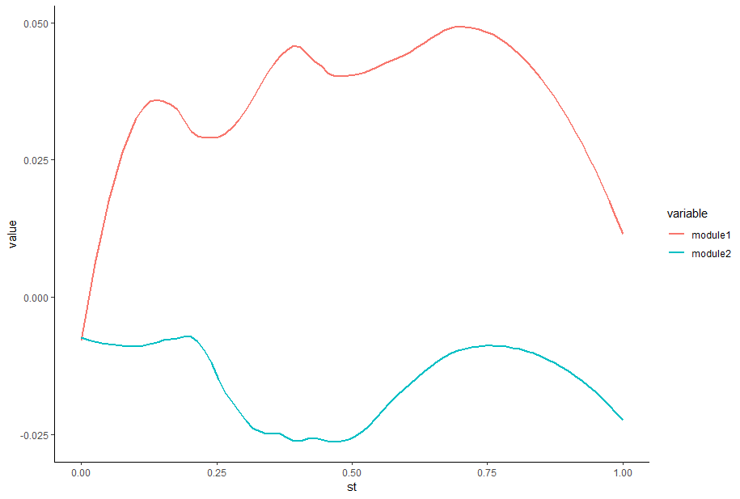
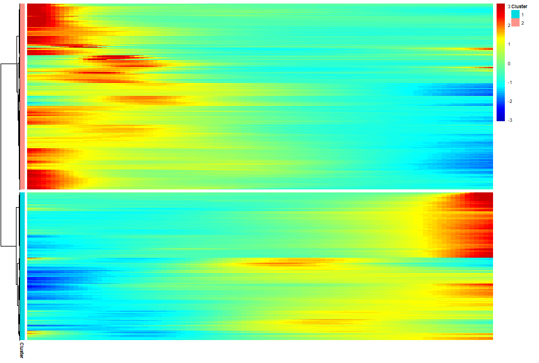

# SpatialTime 
Spatial transcriptomics (ST) enables single cell resolution gene expression analysis assessment across histology sections while preserving the tissue native morphological configuration. In this context, SpatialTime package empower users to assess differential gene expression and module score pathways across a distance gradient by establishing spatially defined reference points and calculating ST spots distances against reference spots using euclidean distances. Thus, a distance gradient can be established allowing the evaluation of gene expression profiling based on proximity of any reference line.     

## Installation

Development version install:
```sh
#(install.packages("devtools")
devtools::install_github("dimitrisokolowskei/SpatialTime")
```
## Dependencies Requirements
The ```igraph``` package version < ```2.1.0``` are required for ```SpatialTime``` package. For instance:

```sh
library(remotes)

remove.packages("igraph") # remove package if previously installed
install_version("igraph", version = "2.0.3")
```

## Prerequisites
SpatialTime package requires a spatial dataset already processed and integrated. Thus, any doubts on how to proceed with ST basic analysis, please visit [Seurat](https://satijalab.org/seurat/articles/spatial_vignette) vignette.

## Introduction 
Fractures represent a severe form of musculoskeletal trauma imposing significant burden for individuals health. Understanding cellular and molecular dynamics upon fractures could provide relevant insights for therapeutic interventions and enhanced injury healing. For this vignette tutorial, we provide a ST example dataset of mice submitted to tibia osteotomy obtained from [Rios et al., 2024](https://insight.jci.org/articles/view/176802#BIBL). Additional files to run the vignette can be found at zenodo repository [here](put_link).

# Analysis Approaches
SpatialTime supports different strategies for delimiting spatial reference spots by: 1) Manually defining references spots using the package build-in Shiny App; 2) Selecting single cell types based on clusters identities; 3) Manually defining references lines using imaging *softwares* such as Fiji/ImageJ. For tutorial purposes, first we'll show how to select spots using the different approaches possible. Then, we'll present how to investigate and visualize gene expression and module score across distance gradients.

## 1. Individual Spots Selection
1.1 First, import processed Seurat object together with libraries required.
```sh
# Libraries
library(Seurat)
library(tidyverse)
library(SpatialTime)
library(shiny)
library(plotly)
library(monocle3)
library(reshape2)

# set.seed for reproducibilty 
set.seed(12345)

# Import object
demo <- readRDS("fracture_demo.rds")
View(demo@meta.data)

# Visualize spatial data colored by specified identity 
ratio <- ScaleRatio(demo) # Adjust image scale (OPTIONAL)

SpatialDimPlot(demo, images = "slice1") +
  theme(aspect.ratio = ratio)
```
1.2 Export cluster's XY coordinates of interest. Make sure that cell types labels are in Seurat object ```Idents()```. In case they're not, clusters labels from ```seurat@meta.data``` can be added into ```Idents()```. For instance:
```sh
Idents(demo) # Check cluster names in Seurat object identity
Idents(demo) <- demo$Tissue # Add cluster label from metadata if not set as theinto objects current identity

# Export cell type coordinates to an output directory
subset2Labels(demo, cluster = c("Cartilage","HypCH","Woven"), export.all = F, dir.out = "coord_out")
```
1.3 Once the desired clusters coordinates to be compared against to have been exported, we'll have to select our reference spots to establish the reference point for gradient distance calculation. The package's build-in Shiny app allows the visualization of individual spatial spots colored by cluster. Additionally, hoovering the mouse cursor over individual spots shows information of which cluster the spots belongs to and its XY coordinate.


To navigate trough the app, use ```shift+left click``` to move around the sample and ```ctrl+left click``` to (un)select the spots. In the top right corner there's ```+``` and ```-``` signs, allowing users to zoom in or zoom out. After spots selection, click ```Export Selected Spots``` and close the Shiny app. The ```id``` parameter have to include ```seurat_obj@meta.data``` column name that contains cell types ID's for better visualization in the shiny app. 


```sh
# First spots selected
Selected spots:
Barcode: GACCGTCAGGTCGTGA-1_1, Cluster: Cartilage, Coordinates: (379.704, -135.0951)
Barcode: CTAGTATTCGGAATTA-1_1, Cluster: Cartilage, Coordinates: (376.2911, -141.045)
Barcode: CAACTATATCGAATGC-1_1, Cluster: Cartilage, Coordinates: (372.8783, -147.0251)
...
```
Run Shiny app and select reference spots:
```sh
# Selecting reference spots 
app <- ShinySelection(demo, id = "Tissue")
app
```
By importing the cluster coordinate and reference spots previously selected, SpatialTime distance gradient can be calculated. For ```CoordMerge``` provide the path for coordinate folder and cluster name in ```pattern = cell_type_name```. Also, import the reference spots coordinates using ```ShinySpots``` function. For example, using the cluster labeled as ```Woven```, it follows:
```sh
# Import coordinates of cluster and reference spots 
frac <- CoordMerge("coord_out/", pattern = "Woven")
ref <- ShinySpots(demo, coord_file = "selected_spots.csv")
# Calculate SpatialTime between cluster and reference ----
sp <- SpatialShinyTime(frac, ref)
sp
```
The visualization of gradient distance axis is a critical step since ensures that the desired distance axis between the clusters of interest is correct for the following steps. Using ```return_obj = F``` distance gradient can be visualized:
```sh
# Visualize spots gradient 
gradient_vis <- SpatialVis(demo, sp, spatial.by = "rel", slice = "slice1", return_obj = F)
gradient_vis +
  theme(aspect.ratio = ratio)
```

After gradient visualization, subsetting out cells, using ```subset``` function that were not included in the gradient distance calculation is recommended, since it allows a cleaner gradient visualization and faster processing. Spatialtime (st) values must be added into ```meta.data``` and cells with st values equals to zero removed:  
```sh
# Calculate gradient distance values and add into metadata
gradient_calc <- SpatialVis(demo, sp, spatial.by = "rel", slice = "slice1", return_obj = T)
View(vis@meta.data)

# Subset out spots which spatialtime (st) value were not calculated
gradient_calc <- subset(gradient_calc, subset = st != 0)

# Continue in Gene Expression Assessement & Visualization
```

## 2. Cluster selection based approach
The basic underlying concept of SpatialTime using the cluster selection based approach is the same as previously described. However, there's no need to manually select spatial spots as reference, since borderline spots within a cluster of interest we'll be used as reference, therefore allowing a faster and straightforward analysis.

2.1 Import Seurat's object and ensure that cell clusters are annotated and present in your object ```Idents()```. 
```sh
# Libraries
library(Seurat)
library(tidyverse)
library(SpatialTime)
library(monocle3)
library(reshape2)

# Import NF1 data ----
demo <- readRDS("fracture_demo.rds")
View(demo@meta.data)

# Export cell type coordinates to an output directory
subset2Labels(demo, cluster = c("Cartilage","HypCH","Woven"), export.all = F, dir.out = "coord_out")
```

2.2 Import clusters coordinates and run ```Spatial2Time``` for gradient distance calculation:
```sh
# Selecting directories specific coordinates ----
woven <- CoordMerge("coord_out", pattern = "Woven")
ref <- CoordMerge("coord_out", pattern = "Cartilage")

# Calculate SpatialTime between clusters of interest ----
sp <- Spatial2Time(woven, ref)
sp
```

2.3 Visualize gradient distance:
```sh
# Distance gradient visualization ----
gradient_vis <- SpatialVis(demo, sp, spatial.by = "rel", slice = "slice1", return_obj = F)
gradient_vis
```

If gradient distance axis follows the desired direction between clusters assign ```return_obj``` to ```TRUE``` allowing spatialtime values addition into object's metadata. For instance:
```sh
# Adding st into metadata
gradient_calc <- SpatialVis(demo, sp, spatial.by = "rel", slice = "slice1", return_obj = T)
View(vis@meta.data)

# Subset out spots which spatialtime (st) value were not calculated
gradient_calc <- subset(gradient_calc, subset = st != 0)

# Continue in Gene Expression Assessement & Visualization
```

## 3. Fiji/ImageJ based approach
Fiji is a broadly used open source scientific image processing tool. Fiji allows drawing the reference lines of interest and exporting each delineated pixel as an XY coordinates later used for euclidean distance calculation. Fiji can be downloaded [here](https://imagej.net/software/fiji/) and a brief Fiji tutorial on how draw and export references lines can be found [here](https://dimitrisokolowskei.notion.site/Fiji-Tutorial-22db3341bbaf8001807ee08e8ab58771?source=copy_link).

3.1 First, import your Seurat ST object using ```readRDS()``` function. Then, we proceed using ```subsetLabels()``` which allows us to export ST clusters coordinates as excel sheets.
```sh
# Required packages
library(Seurat)
library(tidyverse)
library(SpatialTime)
library(monocle3)
library(reshape2)

# Import dataset ----
demo <- readRDS("fracture_demo.rds")
View(demo@meta.data)

# Export clusters coordinates 
subsetLabels("fracture_demo.rds", cluster = c("Cartilage","Woven"), slice.n = "slice1", dir.out = "coord_out")
```

3.2 Import Fiji XY coordinates previously prepared. Furthermore, we need to match the reference line colors to their respective tissue/region names. Be aware that the tissue names must exist in your Seurat object identities. Notice that each slice image have its own ```factor``` value that can be found in the .json file in each 10x output folder. Then, by running ```SpatialCalc()``` each XY coordinate can be transformed accordingly to the slice factor.  
```sh
fiji <- read.csv("Fiji_C1.csv")
colors <- c("Red", "Blue")
tissue <- c("Cartilage","Woven")

data <- SpatialCalc("Fiji_C1.csv", factor = 0.10067452, colors = colors, tissue = tissue)
```
3.3 At this step, SpatialTime distance are ready to be calculated. First, import your cluster type coordinates as reference and calculate the spots distances against other cluster. 
```sh
# Calculate minimum spots distances from reference line of interest
file <- read.csv("coord_out/Woven_coordinates.csv")
sp <- SpatialTime(data, reference = "Cartilage", compare = file)
sp
```

3.4 SpatialTime distance gradient can be assessed using:
```sh
gradient_vis <- SpatialVis(demo, sp, spatial.by = "rel", slice = "slice1", return_obj = F)
gradient_vis
```

3.5 Adding spatialtime values into metadata and subsetting only cells with st values:
```sh
# Visualization spatialtime gradient ----
gradient_calc <- SpatialVis(demo, sp, spatial.by = "rel", slice = "slice1", return_obj = T)
gradient_calc <- subset(gradient_calc, subset = st != 0)
```
# Gene Expression Assessement & Visualization
In this step, independently of spots selection approach use, st values should be included in ```demo@meta.data```. Consequently, pseudotime can be calculated and gene expression analysis visualized as heatmap across distance gradient. For example: 
```sh
# Calculate pseudotime and visualize genes differentialy expressed across distance gradient
ps <- PseudoM3Time(gradient_calc, assay = "SCT", values = "st", return_obj = F)
hm <- gradient_heatmap(ps, rownames = F)
```

Genes expressed across heatmap clusters could be obtained by:
```sh
# Obtain gene names in each heatmap clusters
genes <- GeneGet(hm, n_clusters = 3)
genes

              Cluster          Gene
Jph1                1          Jph1
Mcm3                2          Mcm3
Col9a1              3        Col9a1
Ptpn18              2        Ptpn18
Ankrd23             1       Ankrd23
...
```

By using ```return_obj = T``` Seurat object is returned allowing for individuals gene expression visualization across distances. Additionally, module score pathways can be assessed as follows:   
```sh
# Calculate pseudotime
ps <- PseudoM3Time(gradient_calc, assay = "SCT", values = "st", return_obj = T)
GeneVis(file = ps, column = c("Col2a1", "Ihh","Sox9"), span = 0.5, signal = "gene")
```


```sh
# Gene list pathways
bmp <- c("Acvr1","Amh","Bmp2","Bmp4","Bmp5","Bmp6","Bmp7","Bmp8a","Bmpr1a","Bmpr1b",
         "Bmpr2","Gdf5","Gdf6","Gdf7","Hamp","Hamp2","Id1","Id2","Id3","Id4",
         "Inhbb","Rgma","Rgmb","Smad1","Smad4","Smad5","Smad9")

wnt <- c("Rspo3","Rspo4","Tcf7","Tcf7l1","Tcf7l2","Wnt1","Wnt10a","Wnt10b","Wnt11",
         "Wnt16","Wnt2","Wnt2b","Wnt3","Wnt3a","Wnt4","Wnt5a","Wnt6","Wnt7a","Wnt7b",
         "Wnt8a","Wnt8b","Wnt9a","Wnt9b","Wnt5b","Axin1","Axin2")

# Add gene modules in object with pseudotime calculated
gene_modules <- list(Module1 = bmp, Module2 = wnt)
module <- AddModuleScore(gradient_calc, features = gene_modules, assay = "SCT", name = "module", nbin = 16)
GeneVis(file = module, column = c("module1", "module2"), signal = "pathway", span = 0.5)
```



# Spatial Transcriptomics Visium HD
SpatialTime package also supports 10x genomics Visium HD analysis allowing user to calculate distance gradients in a true single cell resolution. The SpatialTime rationale for HD assays remains with minor modifications from standard cluster-based or image-based approaches. For instance:
```sh
library(Seurat)
library(tidyverse)
library(SpatialTime)
library(monocle)
library(reshape2)

mm <- readRDS("path/seurat_object.rds")

subset2LabelsHD(mm, cluster = c("CellType1", "CellType2"))

ref <- CoordMergeHD("coord_out", pattern = "CellType1")
other <- CoordMergeHD("coord_out", pattern = "CellType2")

sp <- Spatial2TimeHD(other, ref)

gradient_vis <- SpatialVis(mm, sp, spatial.by = "rel", slice = "slice1", return_obj = F) 
gradient_vis
...
```

For Fiji image-based analysis:
```sh
library(Seurat)
library(tidyverse)
library(SpatialTime)
library(monocle)
library(reshape2)

mm <- readRDS("path/seurat_object.rds")

colors <- c("Red")
tissue <- c("CellType1")

data <- SpatialCalc("fiji_output.csv", factor = 1, colors = colors, tissue = tissue)

file <- read.csv("coord_out/{cluster_name}_slice1_coordinates.csv")
sp <- SpatialTimeHD(data, reference = "CellType1", compare = file)
sp

gradient_vis <- SpatialVis(mm, sp, spatial.by = "rel", slice = "slice1", return_obj = F)
gradient_vis
...
```

## Monocle Usage
SpatialTime package was originally conceived using ```monocle``` for spatialvalues calculation mainly to its reliability and heatmap plotting facility. However, monocle's newer versions such as ```monocle3``` brought series of performance and analysis enhancements. Thus, we additionally provide a monocle wrapper function that allows equivalent spatialtime calculation in the standard SpatialTime pipeline. For instance:

```sh
library(monocle)

ps <- Pseudo2Time(gradient_calc, assay = "SCT", return_obj = F)
p <- plot_pseudotime_heatmap(ps, num_clusters = 2, cores = 2, show_rownames = F, return_heatmap = T)
p
```

For downstream analysis, such as module scores, object ```seurat_obj$meta.data``` should be returned instead of a expression matrix. Thus, set ```return_obj = T```:
```sh
ps <- Pseudo2Time(fracture, assay = "SCT", return_obj = T)
```

## Session Info

```sh
R version 4.3.2 (2023-10-31 ucrt)
Platform: x86_64-w64-mingw32/x64 (64-bit)
Running under: Windows 10 x64 (build 19045)

Matrix products: default


locale:
[1] LC_COLLATE=English_United States.utf8  LC_CTYPE=English_United States.utf8    LC_MONETARY=English_United States.utf8
[4] LC_NUMERIC=C                           LC_TIME=English_United States.utf8    

time zone: America/Chicago
tzcode source: internal

attached base packages:
[1] stats     graphics  grDevices utils     datasets  methods   base     

other attached packages:
[1] SpatialTime_0.0.0.9000 testthat_3.2.0         devtools_2.4.5         usethis_2.2.2         

loaded via a namespace (and not attached):
  [1] RcppAnnoy_0.0.21       splines_4.3.2          later_1.3.1            DDRTree_0.1.5          tibble_3.2.1          
  [6] polyclip_1.10-6        rpart_4.1.21           lifecycle_1.0.4        rprojroot_2.0.4        globals_0.16.2        
 [11] processx_3.8.2         lattice_0.21-9         MASS_7.3-60            backports_1.4.1        magrittr_2.0.3        
 [16] limma_3.58.1           Hmisc_5.1-1            plotly_4.10.3          rmarkdown_2.28         yaml_2.3.7            
 [21] remotes_2.4.2.1        httpuv_1.6.12          Seurat_4.2.1           sctransform_0.4.1      askpass_1.2.0         
 [26] spam_2.10-0            spatstat.sparse_3.0-3  sp_2.1-1               sessioninfo_1.2.2      pkgbuild_1.4.2        
 [31] reticulate_1.34.0      cowplot_1.1.1          pbapply_1.7-2          RColorBrewer_1.1-3     abind_1.4-5           
 [36] pkgload_1.3.3          Rtsne_0.16             purrr_1.0.2            BiocGenerics_0.48.1    nnet_7.3-19           
 [41] ggrepel_0.9.4          irlba_2.3.5.1          listenv_0.9.0          spatstat.utils_3.1-0   pheatmap_1.0.12       
 [46] umap_0.2.10.0          RSpectra_0.16-1        goftest_1.2-3          spatstat.random_3.2-1  fitdistrplus_1.1-11   
 [51] parallelly_1.36.0      commonmark_1.9.0       leiden_0.4.3           codetools_0.2-19       xml2_1.3.5            
 [56] tidyselect_1.2.0       viridis_0.6.5          matrixStats_1.1.0      stats4_4.3.2           base64enc_0.1-3       
 [61] spatstat.explore_3.2-5 roxygen2_7.3.2         jsonlite_1.8.7         ellipsis_0.3.2         progressr_0.14.0      
 [66] Formula_1.2-5          ggridges_0.5.4         survival_3.5-7         HSMMSingleCell_1.22.0  tools_4.3.2           
 [71] ica_1.0-3              Rcpp_1.0.11            glue_1.6.2             gridExtra_2.3          xfun_0.44             
 [76] dplyr_1.1.4            withr_2.5.2            combinat_0.0-8         fastmap_1.1.1          xopen_1.0.0           
 [81] fansi_1.0.5            openssl_2.1.1          callr_3.7.3            digest_0.6.33          rcmdcheck_1.4.0       
 [86] R6_2.5.1               mime_0.12              colorspace_2.1-0       scattermore_1.2        tensor_1.5            
 [91] spatstat.data_3.0-3    monocle_2.30.1         utf8_1.2.4             tidyr_1.3.0            generics_0.1.3        
 [96] data.table_1.14.8      prettyunits_1.2.0      httr_1.4.7             htmlwidgets_1.6.2      uwot_0.1.16           
[101] pkgconfig_2.0.3        gtable_0.3.4           lmtest_0.9-40          brio_1.1.3             htmltools_0.5.7       
[106] profvis_0.3.8          dotCall64_1.1-0        tidyverse_2.0.0        SeuratObject_5.0.2     scales_1.3.0          
[111] Biobase_2.62.0         png_0.1-8              knitr_1.48             rstudioapi_0.15.0      tzdb_0.4.0            
[116] reshape2_1.4.4         curl_5.1.0             nlme_3.1-163           checkmate_2.3.0        cachem_1.0.8          
[121] zoo_1.8-12             stringr_1.5.0          KernSmooth_2.23-22     parallel_4.3.2         miniUI_0.1.1.1        
[126] foreign_0.8-85         desc_1.4.2             pillar_1.9.0           grid_4.3.2             fastICA_1.2-3         
[131] vctrs_0.6.4            RANN_2.6.1             slam_0.1-50            urlchecker_1.0.1       VGAM_1.1-9            
[136] promises_1.2.1         xtable_1.8-4           cluster_2.1.4          waldo_0.5.2            htmlTable_2.4.2       
[141] evaluate_0.23          readr_2.1.4            cli_3.6.1              compiler_4.3.2         rlang_1.1.2           
[146] crayon_1.5.2           leidenbase_0.1.25      future.apply_1.11.0    ps_1.7.5               plyr_1.8.9            
[151] fs_1.6.3               stringi_1.7.12         deldir_1.0-9           viridisLite_0.4.2      munsell_0.5.0         
[156] lazyeval_0.2.2         spatstat.geom_3.2-7    Matrix_1.6-4           hms_1.1.3              patchwork_1.2.0.9000  
[161] future_1.33.0          ggplot2_3.5.0          statmod_1.5.0          shiny_1.7.5.1          ROCR_1.0-11           
[166] igraph_2.0.3           memoise_2.0.1R version 4.3.2 (2023-10-31 ucrt)
```
